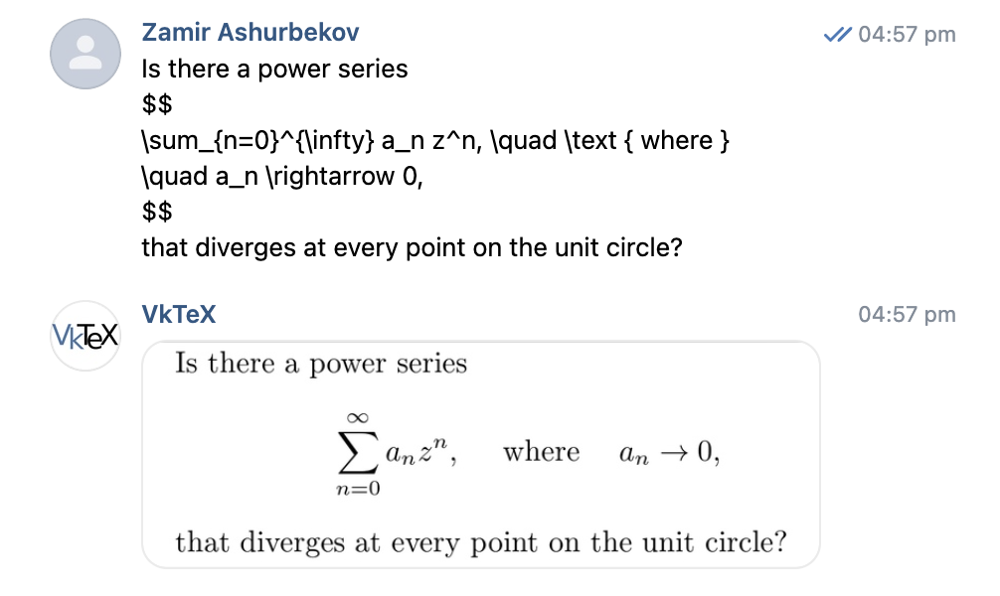

# vktexbot 

[](https://goreportcard.com/report/github.com/ashurbekovz/vktexbot)
[](https://opensource.org/licenses/MIT)

A VK (Vkontakte) bot designed to render LaTeX code snippets into images directly within VK chats.

**Check out the bot in action:** [https://vk.com/vktexbot](https://vk.com/vktexbot)

## Description

Vktexbot listens for messages in VK containing LaTeX code. It uses a locally installed LaTeX distribution to compile the code into an image format (e.g., PNG) and then sends the resulting image back to the chat. This allows users to easily share mathematical formulas, equations, and other LaTeX-formatted content visually within VK.

## Usage

1.  Add the bot to your VK chat or community, or message it directly.
2.  Send a message containing the LaTeX code you want to render.
3.  The bot will process the LaTeX code, compile it, and send back an image of the rendered output. If there's an error during compilation, the bot might send an error message instead.

**Interaction example:**



## Installation & Deployment

### Local

Require docker on local machine

```bash
# 1. Copy and configure the secret file
cp configs/secret.example.yaml configs/secret.yaml

# 2. Run the bot
make run_cmd
```

### Server deployment

Ruquire docker on remote machine

```bash
# 1. Copy and configure the secret file
cp configs/secret.example.yaml configs/secret.yaml

cd deploy

# 2. Copy and configure Makefile
cp Makefile.example Makefile

# 3. Deploy
make deploy
```
